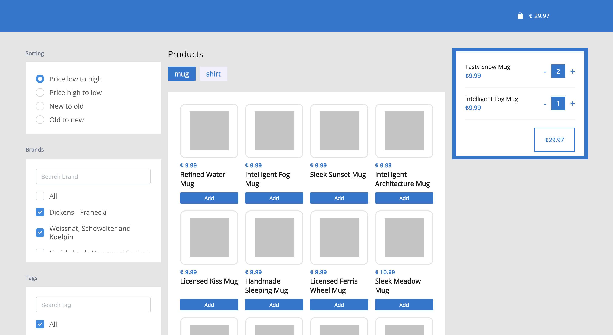
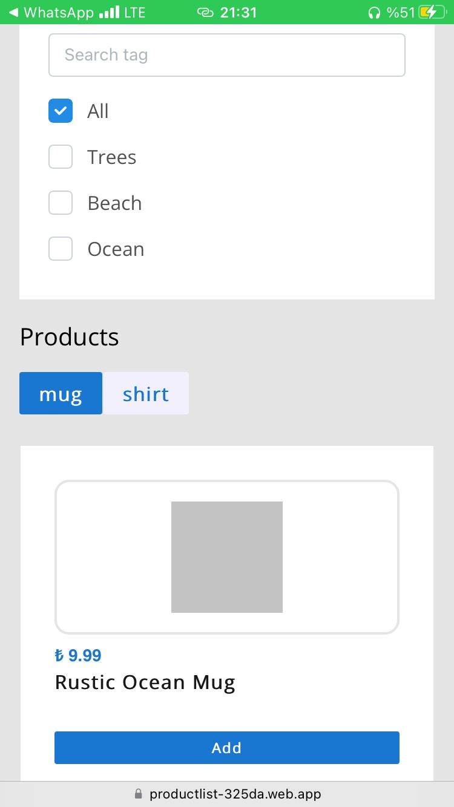

# Product List App

# 

## Demo

Here is a working live demo : https://productlist-325da.web.app/

## Mobile support

The WebApp is compatible with devices of all sizes and all OS's, and consistent improvements are being made.

## Built with

- [React](https://reactjs.org/) - A JavaScript library for building user interfaces.

- [Redux](https://redux.js.org/) - A Predictable State Container for JS Apps.

- [Redux Saga](https://redux-saga.js.org/) - An intuitive Redux side effect manager.

- [Axios](https://axios-http.com/) - Axios is a simple promise based HTTP client for the browser and node.js. Axios provides a simple to use library in a small package with a very extensible interface.

- [Lodash](https://lodash.com/) - A modern JavaScript utility library delivering modularity, performance & extras.

- [Mantine](https://mantine.dev/) - A fully featured React components library.

- [Firebase - Hosting](https://firebase.google.com/) - With Firebase Hosting, you can deploy a single-page web app, a mobile app landing page, or a progressive web app without all the hassle.
